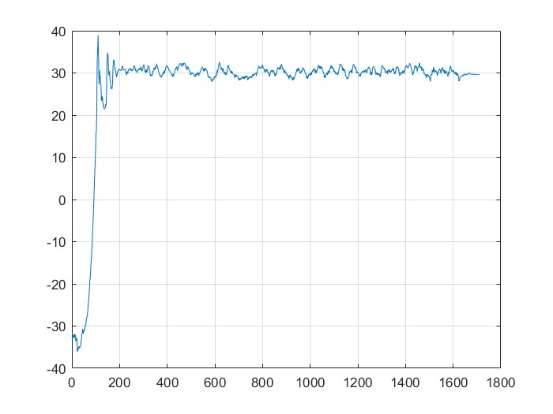
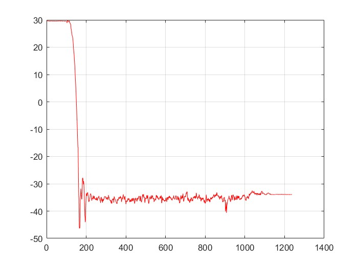
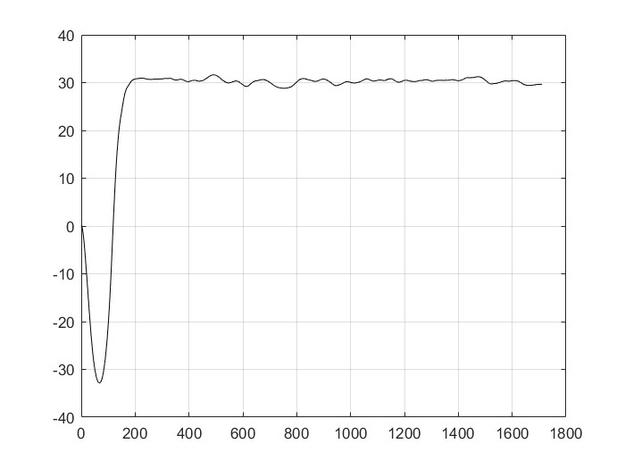
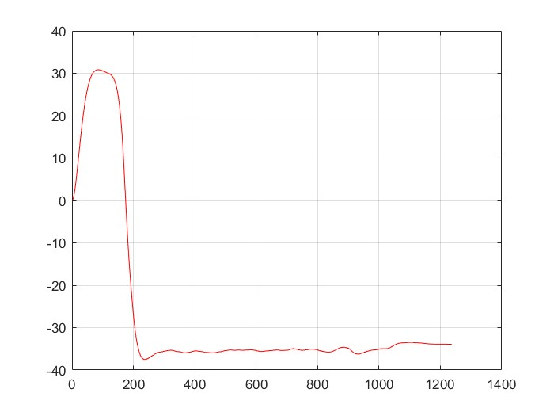
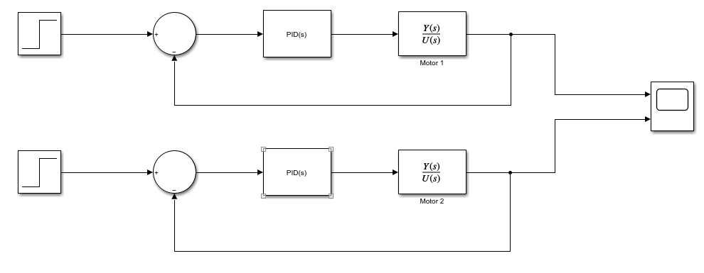
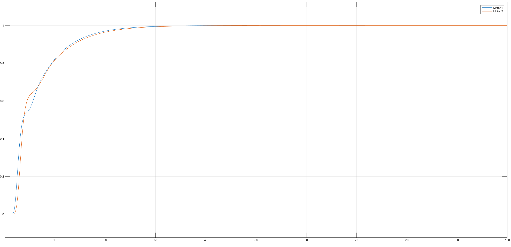
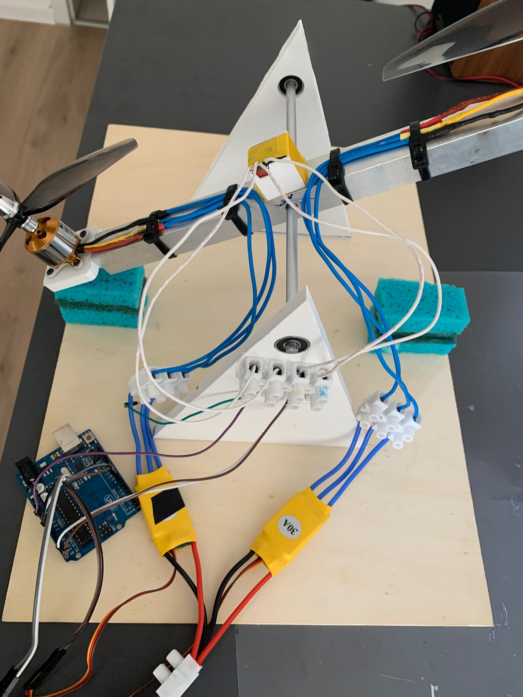

# About

This project was made for our Embedded Systems course. It consists of a drone balancing on one axis using PID.

## The project

For the data collection we used a software made by Roger Meier called [CoolTerm](https://freeware.the-meiers.org/) which basically just transmits the information recieved on a port to a .csv file. 

**For data processing we used MATLAB.** 
1. Import the collected data to look at their frequency spectrum \
Motor 1\
 \
Motor 2\


2. Filter the collected data using a Butterworth filter \
Motor 1 filtered\
 \
Motor 2 filtered\


3. Create the systems in SIMULINK and then use PID tuner to create the PIDs \
The systems in SIMULINK\
\
Their step response\
\

4. Obtaining the parameters of the difference equation
```cpp
// MOTOR1
float upp1[3] = { 0.037556772508577, 0.030728268395416, 0 };
float ypp1[3] = { 1, -1, 0 };
//MOTOR2
float upp2[3] = { -13.100701652605988, 13.043720316359739, 0};
float ypp2[3] = { 1, -1, 0};
```

**After we obtain the parameters of the difference equation we move on to the Arduino code**
1. First we need to calibrate the MPU6050 and find the required offsets
```cpp
 //offsets
  mpu.setXAccelOffset(-3548);
  mpu.setYAccelOffset(-662);
  mpu.setZAccelOffset(1304);
  mpu.setXGyroOffset(-24);
  mpu.setYGyroOffset(152);
  mpu.setZGyroOffset(7);
```
2. Then we use  the *controller()* function  which gives us the actual *speed* needed for the motors in order for the drone to balance itself.
```cpp
float controller(float pos, float target_pos, int esc_pin,
                 float &ups, float &upt, float &yps, float &ypt, float upp[], float ypp[]) {
  //filtrare
  float pos_actual = filter(smooth(pos));  //unghiul actual al ansamblului

  //PID
  float up = target_pos - pos_actual;
  if (up < 3 && up > -3) up = 0;
  float utp = upp[0] * up + upp[1] * ups + upp[2] * upt;
  float ytp = -yps * ypp[1] - ypt * ypp[2];

  //for not stacking too much
  if (ytp < -100) ytp = -100;
  if (ytp > 100) ytp = 100;
  float yp = utp + ytp;
  // and errors
  upt = ups;
  ups = up;
  ypt = yps;
  yps = yp;

  return yp;

```
3. At the end we need to map our values returned from the *controller()* function so they can be applied to our motors
```cpp
  speed1 = map(res1, -125, 125, 1080, 1123);
  speed2 = map(res2, -125, 125, 1030, 1130);

  ESC1.speed(speed1);
  ESC2.speed(speed2);
```

## TEAM
Cojanu Alin\
Constantin Sergiu\
Tase Mihai\
